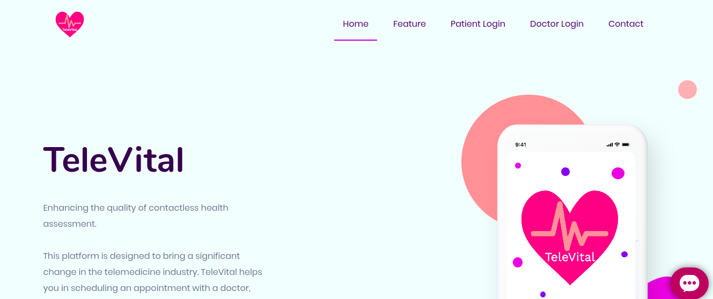

# Project TeleVital

**TeleVital WebApp:** https://televital.azurewebsites.net/
## Description
TeleVital is an AI powered platform designed to help users do preliminary analysis for COVID-19 contraction (COVID-19 assessment test, Vitals test) right at the comfort of their homes.  

TeleVital also provides a platform for hospital / doctors to prioritise on their patients based on their criticality and email patients.

## Components of TeleVital Platform
1. **AI Chatbot:**  	
	The chatbot is capable of conducting a Covid-19 assessment test based on the WHO guidelines and classify the user into three categories (Normal, Moderate, High) of risk of being infected. 
	The chatbot also studies the mental health of users and provides with live mental health therapy. 
2. **Vitals Test:**
	Vitals test helps users in measuring the readings of the users' SpO$_2$, Heart rate and Respiratory rate with just the help of a webcam. This helps the patients in early detection of symptoms of Covid-19, also at the same time reduce the number of people visiting the hospital for preliminary tests.
3. **Digital Prescription:**
	To ease doctors with providing patients, hand-written prescriptions, the digital prescription portal enables the doctors to voice record prescription for patients, and it will further be converted to text and sent directly to patients via mail.
4. **Patient Prioritizer:** 
Understanding the rapid increase in cases of Covid-19, patient prioritizer portal enables hospitals in identifying the high risk patients and giving them the care accordingly.
	 

## Technology stack

1. **Frontend**: HTML, CSS, JavaScript
2. **Backend**: Python - OpenCV, Flask, Numpy, Pandas, Scikit-learn, Pillow, Requests
3. **Database**: Firebase

## Contributors

- Jithin Sunny (jithin_sunny@yahoo.com)
- Rohan Rout (rohan.rout98@gmail.com)
- Rakshit Naidu (rakshit.naidu07@gmail.com)
- Syed Farhan Ahmad (farhan.tuba@gmail.com)
- Joel Jogy (joeljogy07@gmail.com)
